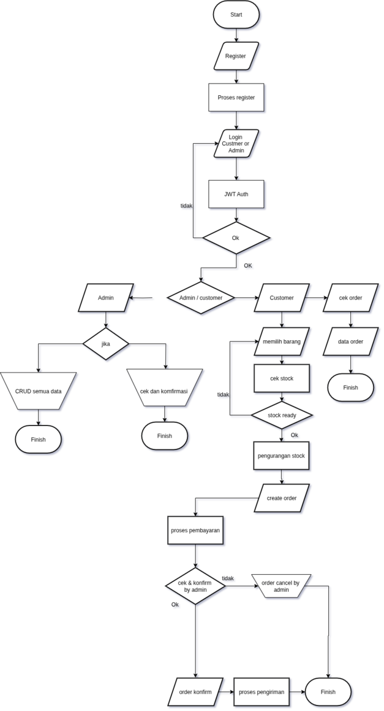
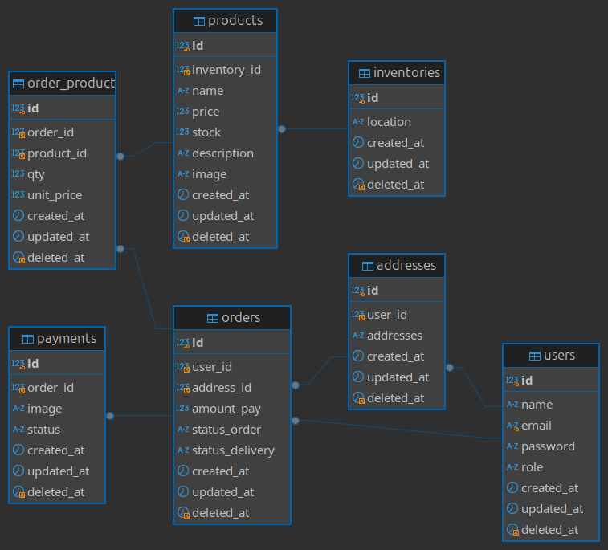

# Simple toko

Teknologi Yang Di Gunakan :
- 
- 
- 
- 
- 
- 
- 
- 

Business flow :



Batasan :
- confirm order manual by admin
- confirm payment manual by admin
- payment manual 
- belum terkoneksi dengan payment gateway
- belum terkoneksi dengan ekspedisi pengiriman

ERD :



## Fitur utama:
- **User Management :** Registrasi customer, admin, login, refresh token, dan autentikasi menggunakan JWT.
- **CRUD :** Product, inventory, order, address, user, payment.
- **Create order :** customer bisa memilih lebih dari satu barang, customer bisa memilih dan mengupdate address
- **Payment :** customer dapat mengupload bukti pembayaran, admin dapat melihat atau download
- **Confirm order & payment  :** confirm by admin only
- **RBAC :** customer hanya bisa melakukan create order, update address, upload payment, melihat product, melihat order. admin dapat full akses fitur
- **Report :** penjualan perbulan, product terlaris dan kurang laris

## Set up local :

- clone repo
- ubah nama file .env.sample jadi .env
- ubah isi file .env sesuai dengan nama database, username, password, host, port, redis address dan redis password masing masing
  ```bash
  DB_NAME=db_toko
  DB_USERNAME=root
  DB_PASSWORD=
  DB_PORT=3306
  DB_HOST=127.0.0.1
  PORT_APP=:8080

  REDIS_ADDRS=127.0.0.1:6379
  REDIS_PWD=
  ```
- un-comment code berikut di file config/db.go :
  ```bash
  // "github.com/joho/godotenv"
  // err := godotenv.Load()
  // if err != nil{
  // 	log.Fatal("error load env")
  // }
  ```
- jalankan di terminal go run main.go

  ```bash
  go run main.go

  ```

- URL Documentation API : https://documenter.getpostman.com/view/22397647/2sB3BLjnnp
